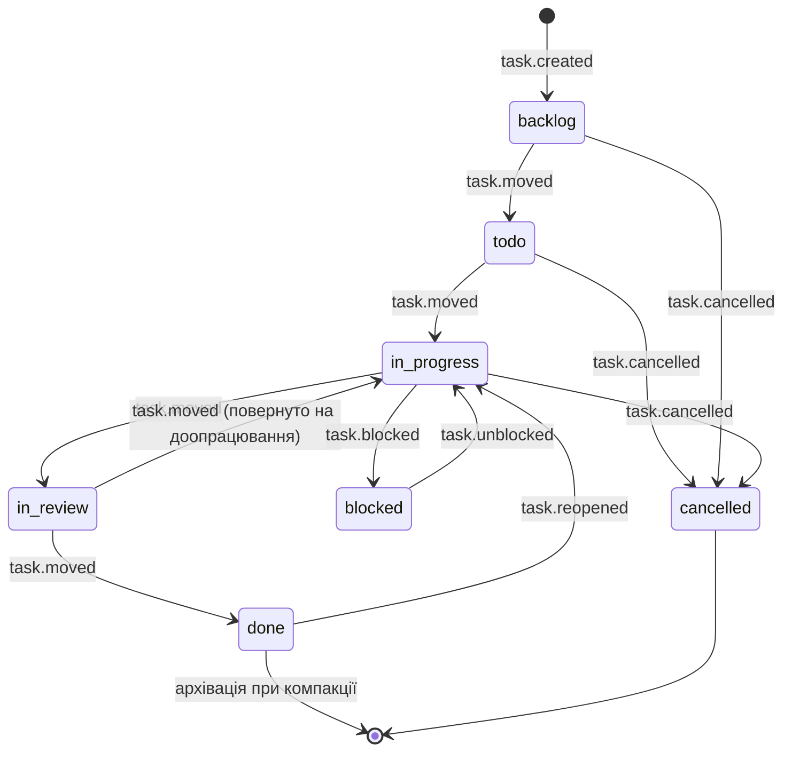
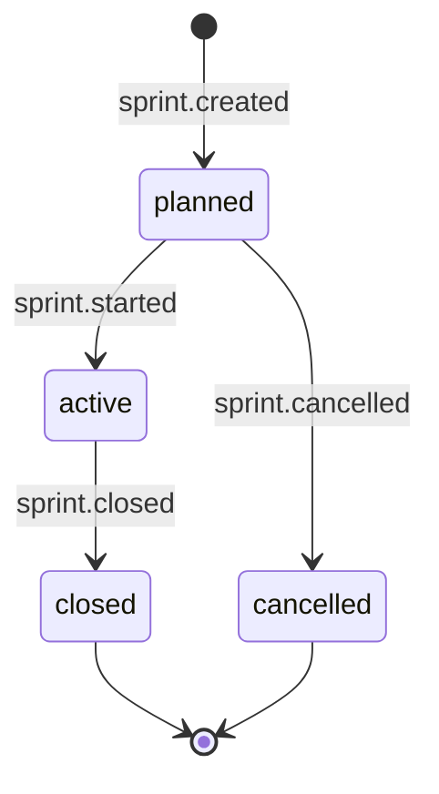

# Стани, переходи та інваріанти

- **Дата:** 2026-09-02
- **Джерело істини:** [SPEC.md](../../SPEC.md) · [ADR-005](../decisions/005-sync-io-and-snapshot.md)

## Чому тут усе інакше, ніж у звичайній машині станів

У класичному застосунку стан змінюється переходом: був `todo`, натиснули кнопку — став `in_progress`. У kadence **стану не існує як збереженої величини.** Є журнал подій, а стан — це результат згортання журналу, обчислений щоразу заново.

З цього випливає три наслідки, яких немає у звичайних машин станів:

1. **Перехід може «прибути з минулого».** Після `git merge` у журналі з'являються події з ULID, меншим за вже врахований. Це не помилка — це нормальна робота розподіленої системи.
2. **Стан не можна «зіпсувати» невалідним переходом.** Подія записується завжди; невалідність з'ясовується при згортанні. Журнал фіксує *наміри*, а стан — їхній детермінований результат.
3. **Один і той самий журнал завжди дає один і той самий стан.** Це головний інваріант системи; усе інше — його наслідки.

## Стани задачі

| Стан | Що означає | Чи входить у velocity |
|---|---|---|
| `backlog` | Створено, у спринт не взято | ні |
| `todo` | Узято в спринт, не почато | ні |
| `in_progress` | У роботі | ні |
| `blocked` | Робота стоїть із зовнішньої причини | ні, але час рахується окремо |
| `in_review` | Робота зроблена, чекає перевірки | ні |
| `done` | Прийнято | **так** |
| `cancelled` | Скасовано | ні, і **не рахується як провал спринту** |

**Тупиків немає.** З `done` є вихід через `task.reopened`, з `cancelled` — ні, і це свідомо: скасована задача не воскресає, замість неї створюється нова з посиланням.

## Стани спринту

`closed` — **термінальний і незворотний**. Причина: velocity закритого спринту стає історичним фактом, на якому будується планування наступних. Якби спринт можна було перевідкрити, кожне таке відкриття переписувало б історію оцінок.

## Інваріанти

Це властивості, які згортання зобов'язане тримати завжди. Кожен має бути тестом.

| # | Інваріант | Що станеться при порушенні |
|---|---|---|
| **I1** | Той самий набір подій → той самий стан, незалежно від порядку читання файлів | Два розробники бачать різний борд на тому самому коміті |
| **I2** | Порядок визначається ULID, ніколи не `ts` і не часом файлу | Розбіжність годинників між машинами ламає стан |
| **I3** | Задача перебуває рівно в одному стані | Неможливий стан: `done` і `in_progress` водночас |
| **I4** | Подія ніколи не видаляється й не редагується | Втрата історії; velocity перестає бути перевірюваним |
| **I5** | Стан закритого спринту не змінюється подіями, що прибули пізніше | Velocity минулих спринтів «пливе» заднім числом |
| **I6** | Видалення `state.json` не змінює стан | Кеш став джерелом істини — клас багів «показує не те» |
| **I7** | Кожна задача має унікальний ULID; `KAD-N` — похідний ярлик | Дві задачі з одним номером після злиття ([Probe A](../research/probe-a-results.md)) |

## Конфлікти намірів і як вони розв'язуються

Це серце системи. «Конфлікт» тут — не конфлікт файлів (їх немає за побудовою), а дві події про одне поле.

| Ситуація | Правило | Чому саме так |
|---|---|---|
| Дві гілки перевели задачу в різні стани | **Last-write-wins за ULID.** Програна подія лишається в журналі й видима в `kadence log` | Детерміновано й пояснювано; людина бачить, що саме програло |
| Дві гілки створили задачу незалежно | Обидві живуть, отримують **різні** `KAD-N` при згортанні | Інваріант I7 |
| Гілка змінює задачу, якої ще немає | Подія **тримається в очікуванні**, застосовується коли прибуде `task.created` | Гілку з створенням могли ще не змерджити |
| Подія про задачу, що вже `done` | Застосовується за загальним правилом; якщо ULID новіший — задача повертається в роботу | Інакше довелося б мовчки ігнорувати намір |
| Подія додає задачу в **закритий** спринт | **Відхиляється** зі збереженням у журналі; задача лишається поза спринтом | Інваріант I5 — velocity не переписується |
| Дві гілки закрили той самий спринт | Перемагає менший ULID (**first-close-wins**) | Виняток із LWW: закриття — фіксація факту, і перше закриття вже могло бути опубліковане |

**`sprint.closed` — єдиний перехід, де діє first-write-wins.** Це навмисна асиметрія, і вона має бути окремо позначена в коді з посиланням на цей документ, бо суперечить загальному правилу.

## Неможливі стани, які архітектура виключає

- Задача одночасно в двох спринтах — подія `sprint.add` перезаписує попередню приналежність за LWW
- Спринт `active` і `closed` водночас — стани взаємовиключні за побудовою діаграми
- Задача `done` без `task.created` — згортання тримає її в очікуванні
- Задача з `KAD-N`, що збігається з іншою — I7

## Що з цього стає тестами

Кожен рядок таблиці конфліктів — окремий тест на трьох гілках. Кожен інваріант — property-тест: генеруємо випадкові набори подій, перемішуємо порядок читання, перевіряємо збіг результату (I1) і одиничність стану (I3).
