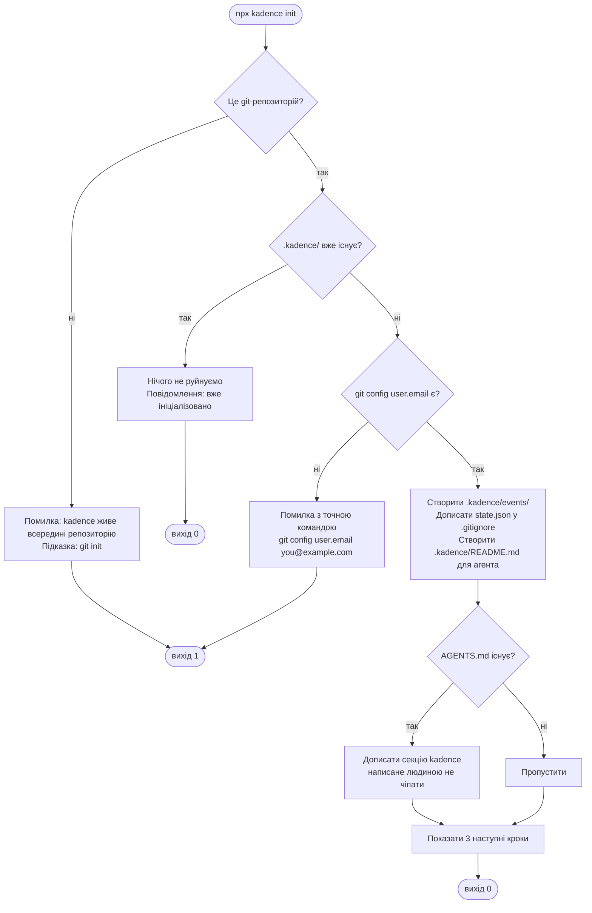
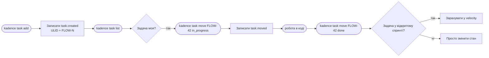
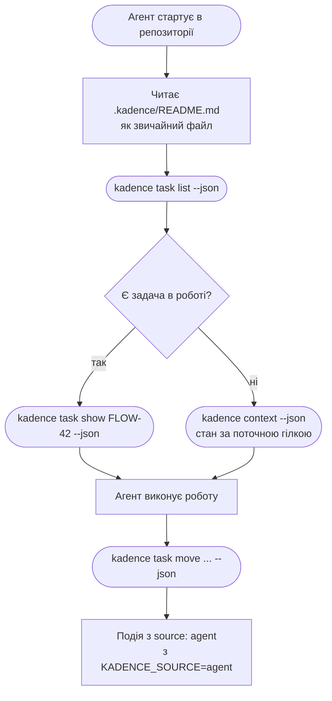
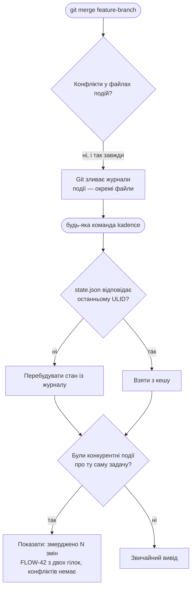
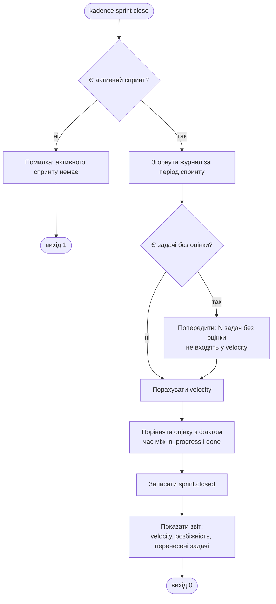

# Потоки користувача

- **Дата:** 2026-09-02
- **Нотація:** овал — вхід/вихід · прямокутник — команда · ромб — розгалуження · `[fs]` — робота з файловою системою

Кожен потік — одна мета користувача. Спершу щасливий шлях, далі гілки помилок.

## Потік 1 — перший запуск

**Мета:** отримати робочий трекер за одну команду.

**Рішення, варте уваги.** `init` **не створює коміт**. Файли з'являються в робочій копії, комітить людина. Це прямо з межі «ніколи не комітити від імені користувача» у [SPEC.md](../../SPEC.md).

## Потік 2 — життєвий цикл задачі

**Мета:** провести задачу від ідеї до `done`.

**Кожна команда, що змінює стан, дописує рівно одну подію** — це критерій приймання M6.

## Потік 3 — робота з агентом

**Мета:** агент бере задачу й працює без переказу контексту людиною.

**Ключова відмінність від конкурентів:** крок B — це читання файлу, а не запит до MCP-сервера. Мережі, токена й запущеного процесу не потрібно.

**У режимі `--json` у stdout лише JSON.** Попередження йдуть у stderr, інакше агент отримає зіпсований вивід — критерій приймання M7.

## Потік 4 — злиття гілок

**Мета:** злити роботу двох людей без ручного розбору задач. Це потік, де продукт доводить свою тезу.

**Крок I — це та сама зміна з [пріоритизації](../product/prioritization.md), що зайшла у v0.1.** Без нього головна властивість продукту спрацьовує невидимо: користувач не дізнається, що щойно уникнув ручної роботи, і не оцінить її.

Формулювати треба фактом, а не хвастощами: «FLOW-42: змерджено 3 зміни з 2 гілок» — і все.

## Потік 5 — закриття спринту

**Мета:** отримати velocity з реальних подій. Це головний меседж [позиціонування](../product/positioning.md).

**Попередження про задачі без оцінки — не косметика.** Оцінка ставиться в `task add`; якщо її пропустили, velocity буде заниженим і людина не зрозуміє чому. Краще сказати прямо.

## Наскрізні правила для всіх потоків

| Правило | Чому |
|---|---|
| Поза git-репозиторієм — зрозуміла помилка, ніколи не стек викликів | Перше враження вирішує, чи буде друга спроба |
| Команда до `init` — пропозиція запустити `init` | Найчастіша помилка новачка |
| Коди виходу: `0` успіх, `1` помилка виконання, `2` помилка в аргументах | Скрипти й CI мають розрізняти |
| Жодна команда не комітить і не пушить | Межа з [SPEC.md](../../SPEC.md) |
| Жодна команда не ходить у мережу | Офлайн — властивість продукту |

## Що з цього стає edge cases

Кожен ромб на діаграмах — точка, де щось може піти не так. Їхній повний розбір — у [edge-cases.md](edge-cases.md).
